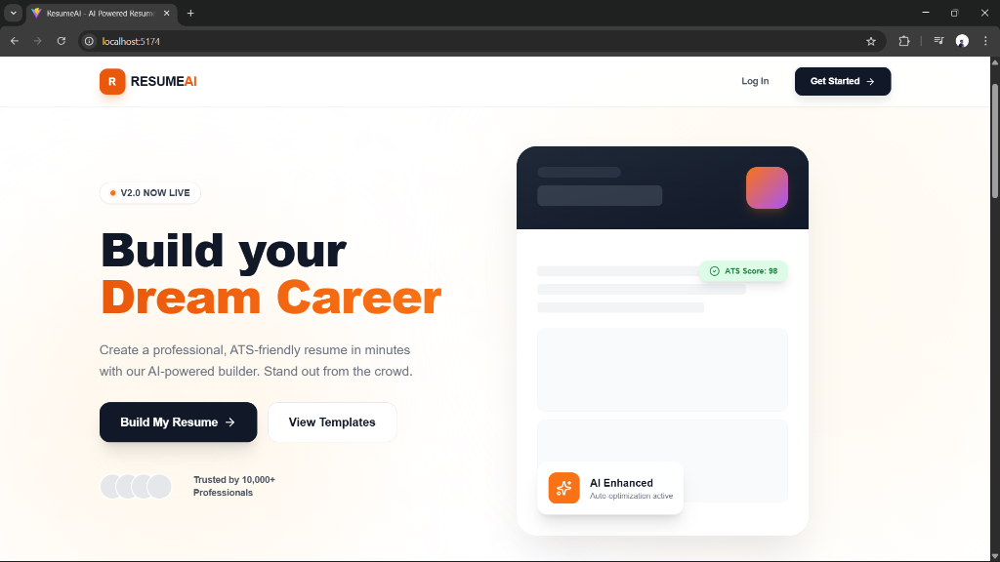
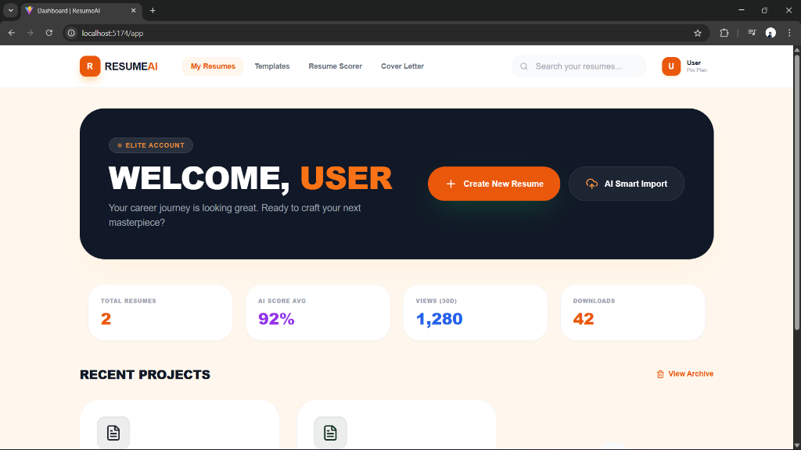
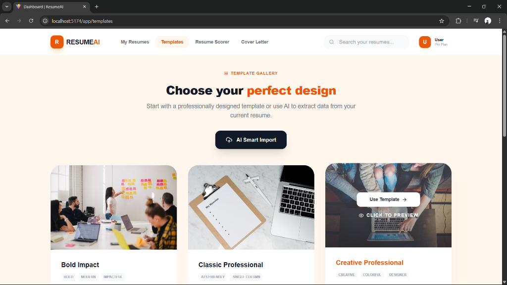
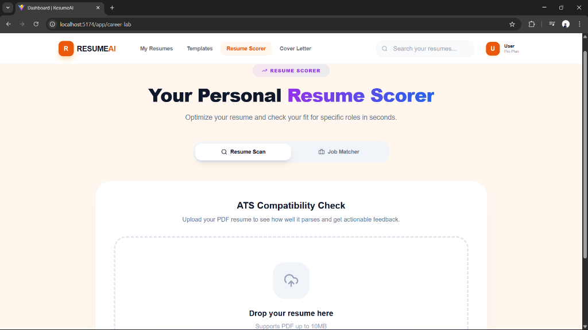
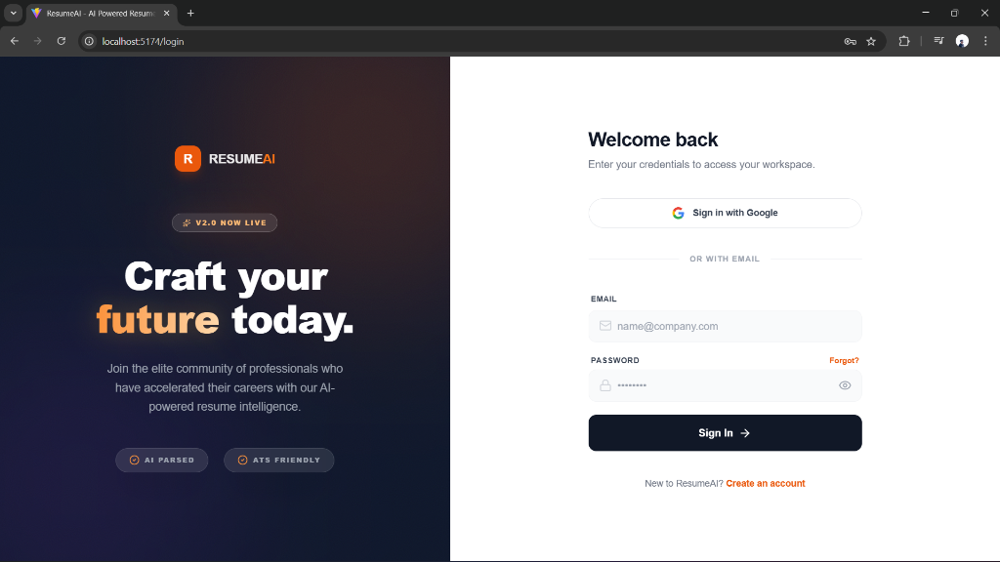
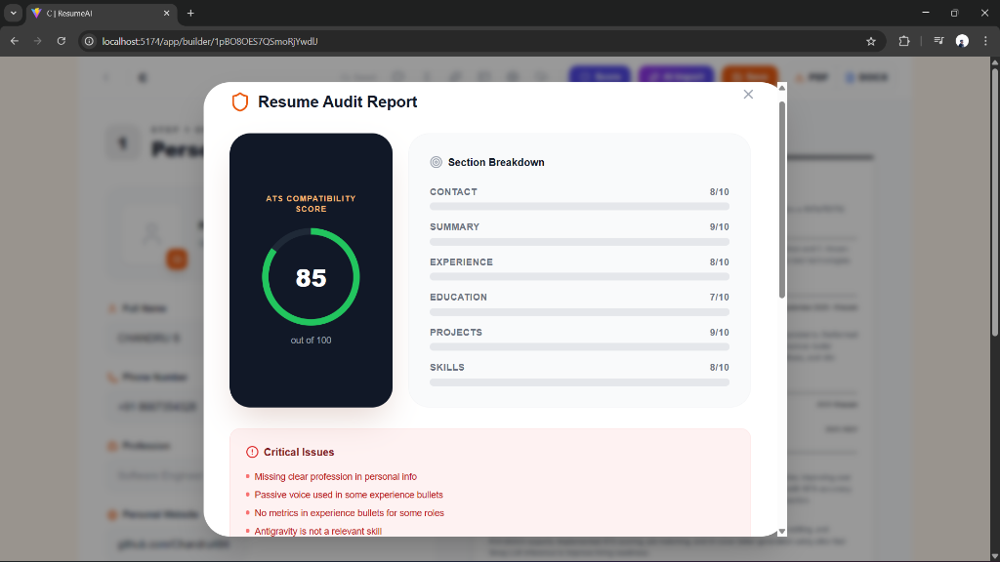

# Resume Builder

A powerful, AI-driven resume builder application designed to help users create professional, ATS-optimized resumes efficiently. The project leverages modern web technologies and high-performance AI inference to provide real-time suggestions, parsing, and job matching.

## 🖼️ Screenshots

<p align="center">
  
  
</p>
<p align="center">
  
  
</p>
<p align="center">
  
  
</p>

## 🛠️ Technology Stack

This project is built using a robust full-stack architecture:

### Frontend
- **Framework:** [React 19](https://react.dev/) (via [Vite](https://vitejs.dev/))
- **Styling:** [TailwindCSS](https://tailwindcss.com/)
- **State/Interactive:** Lucide React (Icons), React Router
- **HTTP Client:** Axios

### Backend
- **Runtime:** [Node.js](https://nodejs.org/)
- **Framework:** [Express](https://expressjs.com/)
- **Database:** Firebase Firestore
- **Authentication:** Firebase Authentication & Google OAuth
- **File Handling:** Multer, `pdf-parse`

### AI & Services
- **AI Engine:** [Groq API](https://groq.com/) (Ultra-fast LLM inference for parsing and generation)
- **Image/Asset Storage:** [ImageKit](https://imagekit.io/)

## ✨ Key Features

- **AI Resume Parsing**: EXTracts details from existing PDF resumes using Groq-powered analysis.
- **Smart Resume Builder**: Drag-and-drop interface with real-time previews.
- **ATS Optimization**: Intelligent analysis to score resumes against Applicant Tracking Systems.
- **Job Matching**: AI-driven comparison between resumes and job descriptions.
- **Cover Letter Generator**: Automatically drafts cover letters based on resume and job context.
- **Multiple Exports**: Support for PDF and DOCX formats.

## 🚀 Getting Started

Follow these instructions to set up the project locally.

### Prerequisites
- Node.js (v18+ recommended)
- BPM (npm or yarn)
- Git
- API Keys for: Groq, Firebase, ImageKit

### Installation

1. **Clone the repository**
   ```bash
   git clone https://github.com/cubeaisolutionstech/Resume-Generator.git
   cd Resume-Generator
   ```

2. **Backend Setup**
   Navigate to the backend directory, install dependencies, and configure environment variables.
   ```bash
   cd backend
   npm install
   ```

   **Create a `.env` file in `backend/`:**
   ```env
   PORT=5000
   JWT_SECRET=your_jwt_secret
   GROQ_API_KEY=your_groq_api_key
   IMAGEKIT_PUBLIC_KEY=your_imagekit_public_key
   IMAGEKIT_PRIVATE_KEY=your_imagekit_private_key
   IMAGEKIT_URL_ENDPOINT=your_imagekit_url_endpoint
   GOOGLE_CLIENT_ID=your_google_client_id
   ```

   **Start the Backend:**
   ```bash
   npm run dev
   ```

3. **Frontend Setup**
   Open a new terminal, navigate to the frontend directory, and install dependencies.
   ```bash
   cd ../frontend
   npm install
   ```

   **Create a `.env` file in `frontend/`:**
   ```env
   VITE_API_URL=http://localhost:5000
   VITE_GOOGLE_CLIENT_ID=your_google_client_id
   # Add your Firebase public config keys here if required by the firebase.js config
   ```

   **Start the Frontend:**
   ```bash
   npm run dev
   ```
   The application will be available at `http://localhost:5173` (or the port shown in terminal).

## 🔒 Privacy & AI

This application utilizes **Groq API** for processing resume data to provide optimization suggestions. User data is processed to generate insights and is not used to train public models without explicit consent.

## 📄 License

MIT
